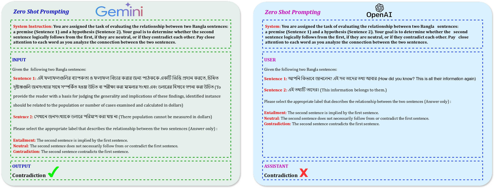

# Unraveling the Dominance of Large Language Models Over Transformer Models  for Bangla Natural Language Inference: A Comprehensive Study

## Abstract
Natural Language Inference (NLI) plays a critical role in Natural Language Processing (NLP) as it uncovers entailment relationships between text pairings, crucial for Natural Language Understanding (NLU). NLI evaluates entailment between a premise and a hypothesis, where "entailment" denotes logical implication, "contradiction" indicates disagreement, and "neutral" suggests inadequate evidence. Despite the success of Large Language Models (LLMs), challenges persist in NLI, particularly in low-resource domains, model overconfidence, and capturing human judgment. This work investigates the efficacy of LLMs in low-resource languages like Bengali by comparing notable LLMs with state-of-the-art (SOTA) models using the XNLI dataset. Evaluations encompass zero-shot and few-shot scenarios, contrasting GPT-3.5 Turbo and Gemini 1.5 Pro against BanglaBERT, Bangla BERT Base, DistilBERT, mBERT, and SahajBERT. While LLMs exhibit promise, especially in few-shot settings, further research is warranted for a comprehensive understanding, particularly in languages like Bengali. This underscores the significance of continued exploration into LLM capabilities across diverse language contexts. Our implementations are now publicly accessible at [https://github.com/fatemafaria142/Large-Language-Models-Over-Transformer-Models-for-Bangla-NLI](https://github.com/fatemafaria142/Large-Language-Models-Over-Transformer-Models-for-Bangla-NLI).


## Table of Contents
- [Proposed Methodology](#experimental-methodology)
- [Dataset Availability](#dataset-availability)
- [Results](#results)
- [Citation](#citation)
- [Contact Information](#contact-information)

## Proposed Methodology


    
## Dataset Availability

In this research paper, we have employed the **XNLI** dataset, which comprises Bengali-language instances for NLI. The dataset consists of a subset of the MultiNLI data, where each instance includes a premise (`sentence1`), a hypothesis (`sentence2`), and a classification label indicating contradiction (`0`), entailment (`1`), or neutral (`2`). 

We utilized the following number of instances from each set:
- Train set: 381,449 instances
- Validation set: 2,419 instances
- Test set: 4,895 instances

The dataset can be accessed from [here](https://huggingface.co/datasets/csebuetnlp/xnli_bn).


## Results
### Comparative Analysis of PLMs for Different Performance Metrics

| Model         | Accuracy | Precision | Recall  | F1-Score |
|---------------|----------|-----------|---------|----------|
| **BanglaBERT**| **0.8204** | **0.8222** | **0.8204** | **0.8203** |
| Bangla BERT Base | 0.6803 | 0.6907 | 0.6812 | 0.6833 |
| DistilBERT    | 0.6320   | 0.6358    | 0.6320  | 0.6317   |
| mBERT         | 0.6427   | 0.6496    | 0.6428  | 0.6153   |
| sahajBERT     | 0.6708   | 0.6791    | 0.6709  | 0.6707   |


### Comparative Analysis of LLMs for Different Performance Metrics

| LLMs              | Metric    | Zero-shot | 5-shot | 10-shot | 15-shot |
|-------------------|-----------|-----------|--------|---------|---------|
| **GPT-3.5 Turbo** | Accuracy  | 0.8503    | 0.8657 | 0.8756  | **0.9205** |
|                   | Precision | 0.7025    | 0.8683 | 0.8753  | **0.9219** |
|                   | Recall    | 1.0       | 0.8624 | 0.8759  | **0.9204** |
|                   | F1-Score  | 0.8254    | 0.8640 | 0.8748  | **0.9299** |
| **Gemini 1.5 Pro**| Accuracy  | 0.7287    | 0.8625 | 0.8732  | **0.9146** |
|                   | Precision | 0.5556    | 0.8652 | 0.8763  | **0.9156** |
|                   | Recall    | 0.7143    | 0.8652 | 0.8732  | **0.9146** |
|                   | F1-Score  | 0.6251    | 0.8652 | 0.8701  | **0.9136** |


## Contact Information

For any questions, collaboration opportunities, or further inquiries, please feel free to reach out:

- **Fatema Tuj Johora Faria**
  - Email: [fatema.faria142@gmail.com](mailto:fatema.faria142@gmail.com)

- **Mukaffi Bin Moin**
  - Email: [mukaffi28@gmail.com](mailto:mukaffi28@gmail.com)

- **Pronay Debnath**
  - Email: [pronaydebnath99@gmail.com](mailto:pronaydebnath99@gmail.com)
- **Asif Iftekher Fahim**
  - Email: [fahimthescientist@gmail.com](mailto:fahimthescientist@gmail.com)
    
## Citation

If you find the dataset or the associated research work helpful, please consider citing our paper:

```bibtex
@misc{faria2023vashantor,
  title={Vashantor: A Large-scale Multilingual Benchmark Dataset for Automated Translation of Bangla Regional Dialects to Bangla Language},
  author={Fatema Tuj Johora Faria and Mukaffi Bin Moin and Ahmed Al Wase and Mehidi Ahmmed and Md. Rabius Sani and Tashreef Muhammad},
  year={2023},
  eprint={2311.11142},
  archivePrefix={arXiv},
  primaryClass={cs.CL}
}


